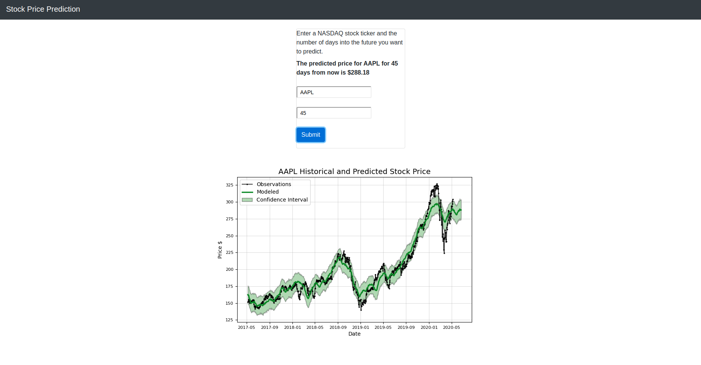
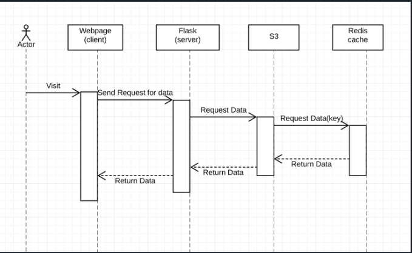

# Stock Prediction on Kubernetes

##### Github: https://github.com/RickyRajinder/stock-prediction-on-kubernetes

# Table of Contents
1. [Introduction](#intro)
2. [Setup Instructions](#seq)
3. [App Function](#func)

## Introduction
 A simple microservice-orientated stock prediction web app 
based on Facebook's open source [Prophet](https://facebook.github.io/prophet/docs/quick_start.html) project and 
[Stocker](https://github.com/WillKoehrsen/Data-Analysis/tree/master/stocker) by Will Koehrsen. 
  

## Setup Instructions <a name="intro"/>
In order to run this app locally, you need [Python](https://www.python.org/downloads/) 3.6
or newer. 

Then install the dependencies via pip3:

` $ pip3 install -r requirements.txt`

You will also need to set up a [Redis](https://redis.io/download) server and an [AWS S3 bucket](https://aws.amazon.com/s3/).

Then you can run the included shell script which starts three Python scripts.

` $ ./run_app.sh `

Since this app was intended to run on Kubernetes, you can use the included Dockerfiles and Kubernetes YAML files
to build the containers and Kubernetes pods/services. 

## Sequence Diagram <a name="seq"/>

## App Function <a name="func"/>

The app functions as follows:

1. User input is sent via Ajax HTTP POST to the Flask webserver. A random request ID is sent as part of the JSON
message.
2. Webserver checks if input is valid and, if so, sends a message containing 
the request ID, the stock ticker name, and the number of days to the data ingestion service. The webserver will poll
Redis until the image and price belonging to the request ID are present. 
3. The data ingestion service is a TCP server. Once it receives a message, it will check if the data for the 
requested stock ticker is in the S3 bucket and if the data is one week or newer. If either of these conditions are
not true, it will query Quandl and Tiingo data platforms for the stock information of the requested stock, save
the data in a CSV file, and upload the file to the S3 bucket. Then it passes on the request ID, the stock ticker, and the 
number of days to the data modeling/forecasting service.
4. The data modeling/forecasting service is a TCP server as well. Once it receives a message, it will download
the CSV file belonging to the stock ticker from S3. It then generates a forecast model and a plots the data to a
graph. The predicted price and the graph PNG file is saved to Redis. 
5. Once the webserver finds the price and graph belonging to the request ID in Redis, it packages the predicted price
and the graph's bytes in base64 in a JSON message, which is served as th response to the Ajax HTTP POST. 
6. The frontend decodes the graph image bytes and displays it using a Javascript Blob.
 

